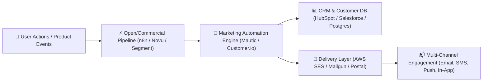

  

  
  
  
  
  
  
  

---

# 🚀 Awesome Marketing Automation & Customer Journey Ecosystem

> A curated list of **SaaS Marketing Automation Platforms**, **Self-Hosted Open-Source Tools**, **Lifecycle Messaging Engines**, and **Customer Journey Orchestration** software.

*Focused on Email Journeys, Lead Nurturing, Campaign Orchestration, Behavioral Segmentation, CRM Integration & Multichannel Engagement.*

---

## 📌 Table of Contents

- [📊 Market Overview](#-market-overview)
- [💼 Commercial SaaS Platforms](#-commercial-saas-platforms)
- [🔓 Open-Source GitHub Projects](#-open-source-github-projects)
- [💡 Architectural Guidance & Patterns](#-architectural-guidance--patterns)
- [🤝 How to Contribute](#-how-to-contribute)
- [💖 Support & Community](#-support--community)
- [⚖️ Disclaimer](#-disclaimer)
- [📈 Star History](#-star-history)

---

## 📊 Market Overview

> 📊 **Market Size & Structure**: The global Marketing Automation market is estimated at **~$9.5 Billion – $12.5 Billion** (projected to reach **$20+ Billion** by 2030 at a 12.8% CAGR). The sector is **moderately fragmented**—led by enterprise cloud behemoths (Salesforce, Adobe) at the top end, balanced by strong specialized mid-market and e-commerce growth leaders (HubSpot, Klaviyo, ActiveCampaign), alongside a rapidly growing ecosystem of developer-first and open-source options.

---

## 💼 Commercial SaaS Platforms

Below is a curated comparison table of commercial SaaS marketing automation platforms, sorted by **Company Scale (Valuation / Revenue)** in descending order.

| Platform | Core Focus & Strengths | Company Scale (Valuation / Revenue) | Starting Paid Price | Free Tier / Trial Limit |
| :--- | :--- | :--- | :--- | :--- |
| 🏢 **[Salesforce Pardot](https://www.salesforce.com/products/marketing-cloud/)** | Enterprise B2B marketing automation, lead scoring, account-based marketing (ABM), & native Salesforce CRM synergy. | **~$250B Market Cap** / $34.8B ARR | $1,250/mo (Growth plan for 10,000 contacts, billed annually) | 30-day interactive sandbox trial (no permanent free tier) |
| 🎨 **[Marketo Engage (Adobe)](https://business.adobe.com/products/marketo.html)** | Enterprise campaign orchestration, complex lead nurturing, multi-touch attribution, & Adobe Experience Cloud suite. | **~$200B Market Cap** / $4.9B Digital Exp. Rev | $895/mo (Growth tier for up to 10,000 contacts) | 14-day guided sandbox demo on request (no permanent free tier) |
| 🐵 **[Mailchimp (Intuit)](https://mailchimp.com/)** | All-in-one email marketing, landing pages, audience segmentation, & e-commerce automation. | **$12B Acquisition** / $16.3B Parent Rev | $13/mo (Essentials tier for 500 contacts) | Free forever plan (up to 500 contacts & 1,000 email sends/mo) |
| 🟧 **[HubSpot Marketing Hub](https://www.hubspot.com/products/marketing)** | Inbound marketing, visual workflows, blog/SEO management, email journeys, & unified CRM ecosystem. | **~$30B Market Cap** / $2.17B ARR | $15/mo per core seat (Starter tier, 1,000 contacts) | Free forever plan (up to 2,000 emails/mo & 1,000 contacts) |
| 📈 **[Klaviyo](https://www.klaviyo.com/)** | Data-driven customer engagement, predictive analytics, & event-triggered automation for e-commerce brands. | **~$8.5B Market Cap** / $900M+ ARR | $20/mo (Email plan for up to 500 contacts) | Free forever plan (up to 250 contacts & 500 email sends/mo) |
| ⚡ **[ActiveCampaign](https://www.activecampaign.com/)** | Flexible customer experience automation (CXA), behavioral email automation, lead scoring, & SMB CRM. | **~$3.0B Valuation** / $250M+ ARR | $15/mo (Starter plan for 1,000 contacts, billed annually) | 14-day full feature free trial (up to 900 contacts, no permanent free tier) |
| 🔁 **[Iterable](https://iterable.com/)** | Cross-channel marketing platform (email, push, SMS, in-app) engineered for high-scale real-time user events. | **~$2.0B Valuation** / $150M+ ARR | $500/mo (Growth starter plan) | 14-day sandbox environment (up to 1,000 test user profiles) |
| ✉️ **[Brevo (Sendinblue)](https://www.brevo.com/)** | Multichannel engagement (email, SMS, chat, WhatsApp) & affordable transactional automation for growing teams. | **~$500M Valuation** / $110M+ ARR | $9/mo (Starter plan for 5,000 email sends/mo) | Free forever plan (300 emails/day, unlimited contacts) |
| 🎯 **[Customer.io](https://customer.io/)** | Developer-friendly behavioral messaging engine for in-app events, transactional email, push, & custom workflows. | **~$350M Valuation** / $60M+ ARR | $100/mo (Essentials plan for 5,000 profiles & 1M emails/mo) | 14-day free trial (full features, up to 1,000 test profiles) |
| 🗺️ **[Ortto (Autopilot)](https://ortto.com/)** | Visual customer journey builder combining CDP data, campaign execution, and multi-channel marketing analytics. | **~$150M Valuation** / $25M+ ARR | $99/mo (Professional plan for 2,000 contacts) | 14-day full feature free trial (2,000 contact limit) |

---

## 🔓 Open-Source GitHub Projects

Open-source tools offer complete data privacy, self-hosting flexibility, zero per-contact licensing fees, and deep customizability. Below is a curated list sorted by **GitHub Star Count** (descending).

| Project | Description & Core Stack | GitHub Stars |
| :--- | :--- | :---: |
| ⚡ **[n8n](https://github.com/n8n-io/n8n)** | Fair-code workflow automation platform with native AI capabilities. Combine visual workflow building with custom code to connect 400+ CRMs, ESPs, and marketing services. *(Node.js / TypeScript)* |  |
| 📣 **[Novu](https://github.com/novuhq/novu)** | Open-source notification infrastructure for email, SMS, push, in-app, and webhooks—acts as a robust delivery and workflow layer for customer communications. *(TypeScript)* |  |
| 🧩 **[Activepieces](https://github.com/activepieces/activepieces)** | Open-source no-code workflow automation platform designed to automate marketing campaigns, lead sync, and CRM operations with 100+ integrations. *(TypeScript / Node.js)* |  |
| 🚀 **[Listmonk](https://github.com/knadh/listmonk)** | High-performance, self-hosted newsletter and mailing list manager with a sleek dashboard, custom templates, and fast bulk/transactional dispatch. *(Go + PostgreSQL)* |  |
| 📮 **[Postal](https://github.com/postalserver/postal)** | Full-featured open-source mail delivery platform for incoming and outgoing application and marketing emails, providing webhooks, tracking, and web admin. *(Ruby / MariaDB)* |  |
| 📝 **[Formbricks](https://github.com/formbricks/formbricks)** | Open-source customer survey and feedback engine for targeted micro-surveys, user profiling, and behavioral lead enrichment. *(Next.js / TypeScript)* |  |
| 🛠️ **[Mautic](https://github.com/mautic/mautic)** | The world's flagship open-source marketing automation suite—visual campaign builder, email journeys, lead scoring, forms, landing pages, & CRM sync. *(PHP / Symfony / MySQL)* |  |
| 💼 **[erxes](https://github.com/erxes/erxes)** | Open-source Experience Operating System (XOS) combining marketing automation, sales pipelines, live chat, and customer service in a single platform. *(TypeScript / React)* |  |
| 💌 **[Mail for Good](https://github.com/freeCodeCamp/mail-for-good)** | Open-source email campaign management platform for non-profits and creators built on top of AWS SES for high-volume delivery. *(Node.js / React)* |  |
| 💬 **[Dittofeed](https://github.com/dittofeed/dittofeed)** | Developer-first, open-source customer engagement platform for automated lifecycle and transactional messages across email, SMS, WhatsApp, and push. *(TypeScript / ClickHouse)* |  |
| 📤 **[SendPortal](https://github.com/mettle/sendportal)** | Self-hosted email marketing management platform for managing subscribers, lists, and campaign tracking via third-party SMTP/SES providers. *(PHP / Laravel)* |  |
| 📰 **[phpList](https://github.com/phpList/phplist3)** | Battle-tested open-source newsletter and email marketing system for subscriber list management, click tracking, and segment automation. *(PHP / MySQL)* |  |
| 🏛️ **[CiviCRM](https://github.com/civicrm/civicrm-core)** | Open-source constituent relationship management (CRM) suite tailored for nonprofits, associations, and civic groups with automated email journeys. *(PHP / MySQL)* |  |

---

## 💡 Architectural Guidance & Patterns

### 🎯 SaaS vs. Open-Source Selection Criteria

- **Choose SaaS Platforms** (e.g. HubSpot, Marketo, ActiveCampaign, Klaviyo) when your priority is speed to market, out-of-the-box deliverability infrastructure, non-technical team usability, native CRM sync, and dedicated enterprise support.
- **Choose Open-Source Software** (e.g. Mautic, Listmonk, Novu, n8n) when data sovereignty, strict privacy compliance (GDPR/CCPA), freedom from per-contact billing caps, custom data schema integration, and full system ownership are primary.

---

## 🤝 How to Contribute

Contributions are warmly welcomed! To suggest a new marketing automation platform, tool, or open-source repository:

1. **Fork** this repository.
2. Create a new topic branch: `git checkout -b feature/add-new-tool`.
3. Add or edit entries in `README.md` adhering to the table format.
4. Ensure descriptions are objective, link directly to official project repositories/sites, and include accurate pricing/star badges.
5. Submit a **Pull Request** with a clear explanation of your addition.

---

## 💖 Support & Community

Thank you for visiting **Awesome Marketing Automation**! If this repository has helped you evaluate or build your marketing technology stack, consider showing support:

- ⭐ **Star this repository** to improve discoverability for other growth engineers and marketers!
- 🔀 **Fork & Share** with your network, colleagues, and developer communities.
- 💬 Join the conversation in our [Discord Community](https://discord.gg/jc4xtF58Ve).
- ☕ **Sponsor / Buy me a coffee**: Support ongoing curation and open-source tooling on the [GitHub Sponsors Dashboard](https://github.com/sponsors/ishandutta2007).

---

## ⚖️ Disclaimer

- This is a **community-curated** educational index and does not constitute official commercial endorsement.
- Marketing automation systems handle sensitive personal customer data. Always ensure compliance with GDPR, CCPA, CAN-SPAM, CASL, and relevant data protection regulations. Self-hosted email infrastructure requires proper SPF, DKIM, DMARC, and subscriber consent management.

---

## 📈 Star History

---

  Maintained with ❤️ for marketers, growth engineers, and open-source enthusiasts worldwide.

